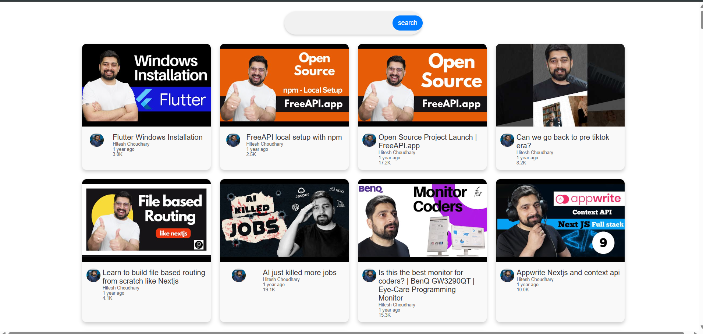
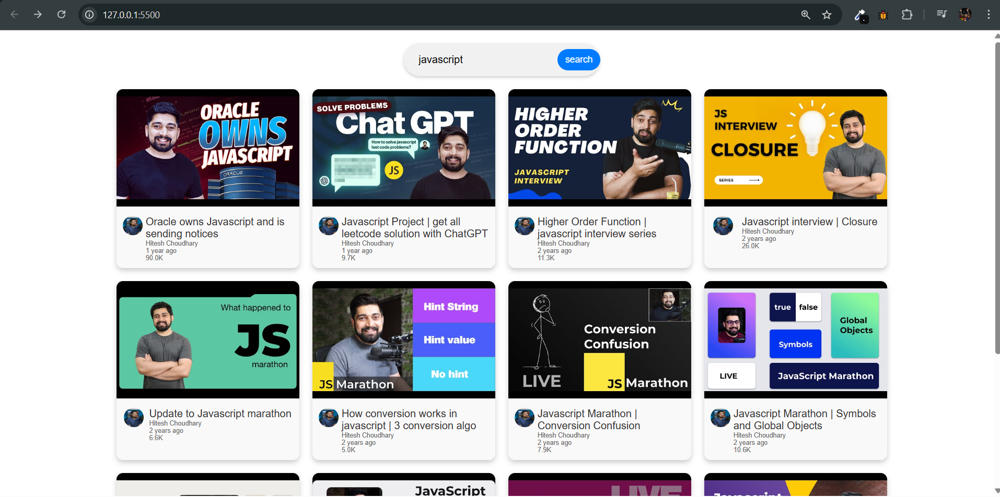

# 📌 YouTube Video Fetcher with Search Functionality

A simple web application that fetches **YouTube videos** from an API and displays them in an interactive **card layout** with thumbnails, titles, views, and more.

---

## 📌 Application Features
✅ **Fetches YouTube videos** from an API  
✅ **Search bar** to filter videos dynamically   
✅ **Responsive design** with smooth animations  
✅ **Displays views in K (thousands) or M (millions)**  
✅ **Published date shown as "X weeks/months ago"**  
✅ **Clickable video thumbnails redirect to YouTube**   

---


---

## 📸 Screenshots
### 🔵 Home Screen


### 🔍 Search Functionality

---

## 🚀 Deployment
The project is deployed and accessible online.

🔗 **Live Demo**: [Click Here](your-deployment-link)  


---

## ⚙️ Installation & Usage
1. **Clone the repository**  
   ```bash
   git clone https://github.com/AJTITAN/yt-clone.git
   cd yt-clone
   
2. Open index.html in a browser
3. To run locally, use Live Server in VS Code

